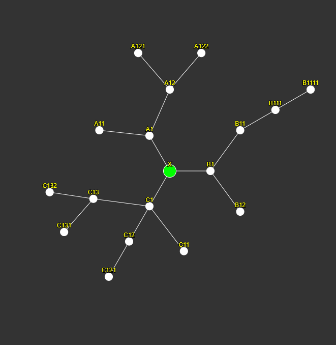

# Efficient and Scalable Videogame Skill-trees

> A sophisticated skill-tree system, written in JavaScript (p5.js graphics) and designed with scalability and rapid development in mind.

No more tedious number crunching and placing nodes by each `(x,y)` coordinate, or coding a spaghetti of if-statements. Just define a skill-tree as a basic JSON hierarchy (see example) and all is handled for you.

[![Demo][demo-shield]][demo-url]

## Features

- Hybrid data structure. Skill-tree can be defined using a simple JSON heirarchy, then converted into a tree data structure behind the scenes for algorithmic purposes.

- Weighted pathfinding. Uses Djikstra's recursive pathfinding algorithm to find the cheapest path to unlock a chosen skill.

- Dynamic layout. Recursive functionality using some maths/trigonometry to dynamically arrange a tree data structure into a circular spanning pattern as you see in the demo.

- Rapid development. Easily create or change your game's entire skill system in a matter of seconds. Simply change the markup, no need to change any code.

- Simple architecture and polymorphism. The SkillNode class can easily be inherited to create new skills with different behaviour if your game needs so.

## Code

```
src
 ├─── main.js         The main p5.js sketch file.
 ├─── skillNode.js    Tree Node class (specify skill attributes e.g. name, price).
 └─── skillTree.js    Tree class (handles auto-layout, path-finding).
```

## Example

A skill-tree can be defined in a simple markup manner using JSON; defining the skill name, it's cost, and it's child nodes.

```js
const tree = new SkillTree({
  node: new SkillNode("X", 20),
  children: [
    {
      node: new SkillNode("A1", 20),
      children: [
        {
          node: new SkillNode("A11", 20),
          children: [],
        },
        {
          node: new SkillNode("A12", 20),
          children: [
            {
              node: new SkillNode("A121", 20),
              children: [],
            },
            {
              node: new SkillNode("A122", 20),
              children: [],
            },
          ],
        },
      ],
    },
    {
      node: new SkillNode("B1", 20),
      children: [
        {
          node: new SkillNode("B11", 20),
          children: [
            {
              node: new SkillNode("B111", 20),
              children: [
                {
                  node: new SkillNode("B1111", 20),
                  children: [],
                },
              ],
            },
          ],
        },
        {
          node: new SkillNode("B12", 20),
          children: [],
        },
      ],
    },
    {
      node: new SkillNode("C1", 20),
      children: [
        {
          node: new SkillNode("C11", 20),
          children: [],
        },
        {
          node: new SkillNode("C12", 20),
          children: [
            {
              node: new SkillNode("C121", 20),
              children: [],
            },
          ],
        },
        {
          node: new SkillNode("C13", 20),
          children: [
            {
              node: new SkillNode("C131", 20),
              children: [],
            },
            {
              node: new SkillNode("C132", 20),
              children: [],
            },
          ],
        },
      ],
    },
  ],
});
```

The recursive trigonemtric layout function will dynamically arrange this tree as shown below:



[demo-shield]: https://img.shields.io/badge/Try%20It%20Out!-0a66c2?style=for-the-badge
[demo-url]: https://tedalden.github.io/skill-tree-demo/
